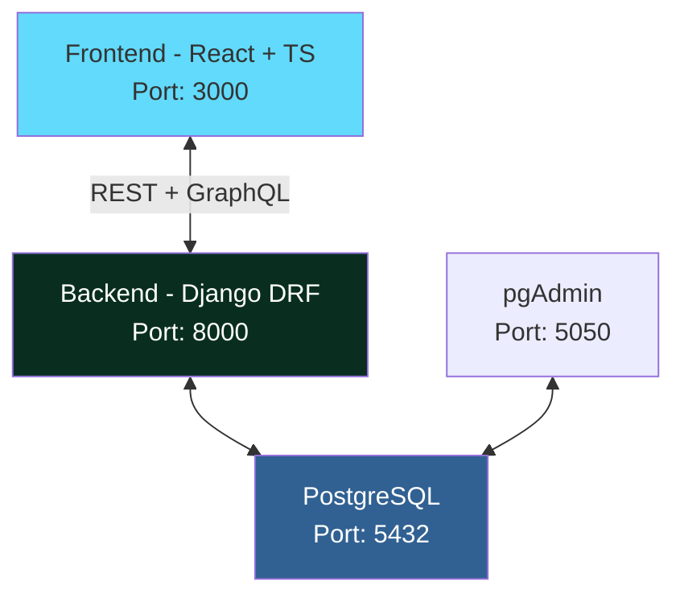

<div align="center">

# 🏠 Dormitory Management System

<p align="center">
  
  
</p>

<p align="center">
  
  
  
  
  
</p>

<p align="center">
  <i>A full-stack SOA-based platform that digitizes dormitory management — connecting students, supervisors, and admins with transparent, efficient digital workflows.</i>
</p>

</div>

---

## ✨ Project Description

A **full-stack SOA-based** web platform that digitizes dormitory management. It connects **students**, **supervisors**, and **admins** with transparent, efficient digital workflows — replacing paper-based processes.

**Key Features** (aligned with SRS):

| Feature | Description |
|---|---|
| 🔧 Maintenance | Maintenance reports, cleaning & supply requests |
| 📅 Classes & Events | Class/event registration & rating |
| 💡 Ideas & Feedback | Idea submission, voting & complaint handling |
| 🏪 Marketplace | Marketplace booth requests |
| 📢 Announcements | Announcements & notifications |
| 🤖 AI Moderation | AI content moderation *(in progress)* |

---

## 📐 Architecture Overview



| | |
|---|---|
| **Architecture Pattern** | Service-Oriented Architecture (SOA) |
| **API Protocols** | RESTful + GraphQL |
| **API Docs** | Swagger (`/swagger/`) + GraphQL Playground (`/graphql/`) |

---

## 🛠️ Tech Stack

| Layer | Technology |
|---|---|
| **Frontend** | React 18 + TypeScript + Vite |
| **State Mgmt** | Redux Toolkit |
| **UI** | Tailwind CSS |
| **Backend** | Python + Django + DRF |
| **API** | REST + GraphQL (Graphene) |
| **Auth** | JWT (SimpleJWT) |
| **Database** | PostgreSQL 16 |
| **Docs** | Swagger (drf-yasg) |
| **Container** | Docker + Docker Compose |
| **Other** | CORS, Media Upload, Persian Support |

---

## 📁 Project Structure (Dev Branch)

```text
dormitory-management/
├── backend/                          # Django (Modular)
│   ├── announcements/                # Announcements & notifications
│   ├── classes/                      # Class management
│   ├── config/                       # Settings
│   ├── core/                         # Shared utilities
│   ├── dorms/                        # Dormitory structure
│   ├── ideas/                        # Ideas, complaints, voting
│   ├── requests_app/                 # All requests (most active)
│   ├── users/                        # Auth & profiles
│   ├── Dockerfile
│   ├── manage.py
│   └── requirements.txt
├── frontend/                         # React + TS
│   ├── src/
│   │   ├── components/
│   │   ├── pages/
│   │   ├── store/ (Redux)
│   │   └── services/ (API)
│   ├── Dockerfile
│   └── nginx.conf
├── docs/                             # Documentation
│   ├── database.md
│   └── database_v3.md
├── docker-compose.yml
├── .env.example
└── README.md
```

---

## ⚡ Quick Start

### Prerequisites

- 🐳 Docker Desktop
- 🔧 Git

```bash
git clone https://github.com/osvehHasanpour/dormitory-management.git
cd dormitory-management
git checkout Dev

cp .env.example .env
docker-compose up -d --build
```

### First-time Setup

```bash
docker-compose exec backend python manage.py migrate
docker-compose exec backend python manage.py createsuperuser
```

---

## 🌐 Service URLs

| Service | URL | Credentials |
|---|---|---|
| **Frontend** | http://localhost:3000 | — |
| **Backend API** | http://localhost:8000/api/ | — |
| **Swagger** | http://localhost:8000/swagger/ | — |
| **GraphQL** | http://localhost:8000/graphql/ | — |
| **Django Admin** | http://localhost:8000/admin/ | Superuser |
| **pgAdmin** | http://localhost:5050 | `admin@dormitory.com` / `admin123` |

---

## 📊 UML Diagrams

### 1. High-Level Use Case Diagram

```text
[Actor] Student          [Actor] Supervisor         [Actor] Admin
     │                        │                          │
     ├─ Login/Logout ────────┼──────────────────────────┤
     ├─ Submit Request ──────┼─ Manage Requests ────────┤
     ├─ View Announcements ──┼─ Create Announcements ───┤
     ├─ Register Class ──────┼─ Manage Classes ─────────┤
     ├─ Submit Idea/Vote ────┼─ Review Ideas ───────────┤
     └─ Rate Services ───────┴──────────────────────────┘
```

### 2. Simplified Class Diagram (Key Models)

```text
User (Abstract)
├── Student
├── Supervisor
└── Admin

Request (Polymorphic)
├── MaintenanceReport
├── CleaningRequest
├── SupplyRequest
└── BoothRequest

Announcement
Class/Event
Idea (with votes)
Rating
```

---

## 🐳 Docker Commands

```bash
# Start all services
docker-compose up -d --build

# Stop all services
docker-compose down

# View backend logs
docker-compose logs -f backend

# Create migrations
docker-compose exec backend python manage.py makemigrations
```

## 👥 Team

<div align="center">

| Name | Role |
|---|---|
| **Osveh Hasanpour** | Developer |
| **Razieh Delvari** | Scrum master |
| **Mahshid Haji Shirmohammadi** | Developer |
| **Zeinab Golchin** | Developer |
| **Hanieh Tebianian** | Developer |
| **Dr. Mehran Alidoust Nia** | Supervisor |

</div>

---


<div align="center">

⭐ **Star this repo if you find it useful!**

</div>
