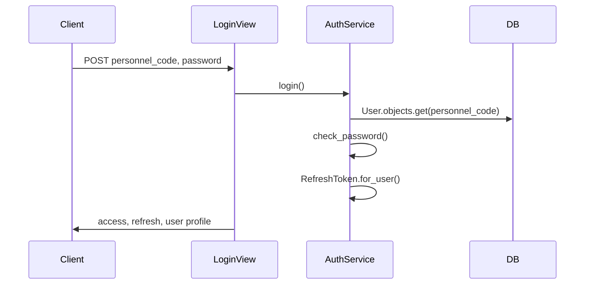

# API Structure & Endpoints

All REST endpoints live under `/api/v1/` unless noted. Responses use a consistent **envelope**:

```json
{
  "success": true,
  "message": "پیام فارسی",
  "data": { }
}
```

Errors:

```json
{
  "success": false,
  "message": "توضیح خطا",
  "errors": { "field": ["جزئیات"] }
}
```

**Authentication:** `Authorization: Bearer <access_token>` (JWT from SimpleJWT)

**Default permission:** `IsAuthenticated` (DRF global setting)

**Pagination:** Page-number style, 20 items per page (`count`, `next`, `previous`, `results`)

**OpenAPI docs:** http://localhost:8000/api/docs/

---

## Authentication (`/api/v1/auth/`)

| Method | Endpoint | Permission | Description |
|--------|----------|------------|-------------|
| POST | `/login/` | AllowAny | Login with `personnel_code` + `password` → access + refresh + user profile |
| POST | `/logout/` | Authenticated | Blacklist refresh token (body: `{ "refresh": "..." }`) |
| GET | `/profile/` | Authenticated | Current user profile with block, room, role |
| POST | `/token/refresh/` | AllowAny | Refresh access token |

### Login Flow



**JWT settings:**

| Setting | Value |
|---------|-------|
| Access token lifetime | 15 minutes |
| Refresh token lifetime | 7 days |
| Rotate refresh tokens | Yes |
| Blacklist after rotation | Yes |

Initial passwords in seed data: user's `national_code`.

---

## Dorms (`/api/v1/blocks/`)

| Method | Endpoint | Description |
|--------|----------|-------------|
| GET | `/` | List all blocks |
| GET | `/{id}/floors/` | Floor list for a block (derived from rooms or `total_floors`) |

Used by frontend block/floor selectors in maintenance and cleaning forms.

---

## Requests (`/api/v1/requests/`)

### Unified Student Endpoints

These endpoints work across **all request types** using `RequestBase` + type resolution:

| Method | Endpoint | Permission | Description |
|--------|----------|------------|-------------|
| GET | `/my/` | IsStudent | Paginated unified list of student's requests |
| GET | `/{pk}/` | IsStudent | **Polymorphic detail** — resolves MTI child and returns typed payload |

**Query params for `/my/`:**

| Param | Values |
|-------|--------|
| `request_type` | `maintenance`, `cleaning`, `item`, `booth` (optional filter) |

**Detail endpoint status:** ✅ **Implemented and wired to frontend** (`fetchRequestDetail` → `RequestDetailSheet`).

The detail view uses `RequestSelector.resolve_typed_request()` and `serialize_request_detail()` to return the correct serializer per type (maintenance includes `photo_url`, `category`; item includes nested `item`, etc.).

### Type-Specific ViewSets (DRF Router)

Base path: `/api/v1/requests/`

| Resource | List | Create | Retrieve | Status PATCH | Timeline GET |
|----------|------|--------|----------|--------------|--------------|
| Maintenance | `GET /maintenance/` | `POST /maintenance/` | `GET /maintenance/{id}/` | `PATCH /maintenance/{id}/status/` | `GET /maintenance/{id}/timeline/` |
| Cleaning | `GET /cleaning/` | `POST /cleaning/` | `GET /cleaning/{id}/` | `PATCH /cleaning/{id}/status/` | `GET /cleaning/{id}/timeline/` |
| Items | `GET /items/` | `POST /items/` | `GET /items/{id}/` | `PATCH /items/{id}/status/` | `GET /items/{id}/timeline/` |
| Booths | `GET /booths/` | `POST /booths/` | `GET /booths/{id}/` | `PATCH /booths/{id}/status/` | `GET /booths/{id}/timeline/` |

**Permissions:**

- **Create:** `IsStudent` only
- **List/Retrieve:** `CanAccessRequests` (student sees own; supervisor/admin sees all)
- **Status change:** `CanSuperviseRequests` (supervisor/admin)

**Status change body:**

```json
{
  "status": "in_progress",
  "comment": "optional note",
  "rejection_reason": "required when status is rejected",
  "assigned_staff": 5
}
```

### Inventory

| Method | Endpoint | Description |
|--------|----------|-------------|
| GET | `/inventory-items/` | List available inventory items for item requests |

---

## Unified Request Handling Architecture

```mermaid
flowchart TD
    A[HTTP Request] --> B{Endpoint type?}
    B -->|/my/| C[RequestSelector.get_student_queryset]
    B -->|/{pk}/| D[RequestSelector.get_request_for_user]
    B -->|/maintenance/ etc.| E[BaseRequestViewSet]
    D --> F[resolve_typed_request]
    F --> G[serialize_request_detail]
    E --> H[RequestService.create_* / change_status]
    H --> I[RequestStatusHistory]
    H --> J[Notification signal]
    C --> K[RequestBaseSerializer]
```

**Layers:**

| Layer | Location | Role |
|-------|----------|------|
| Views | `requests_app/views.py` | HTTP, permissions, envelope responses |
| Selectors | `requests_app/selectors/` | Querysets, access control, prefetch |
| Services | `requests_app/services/` | Create, status transitions, validation |
| State machine | `requests_app/services/state_machine.py` | Valid status transitions |
| Serializers | `requests_app/serializers.py` | Input validation + typed output |

**Multi-table inheritance resolution:**

```python
# Child model map in RequestSelector
{
    'maintenance': MaintenanceRequest,
    'cleaning': CleaningRequest,
    'item': ItemRequest,
    'booth': BoothRequest,
}
```

---

## Complaints & Suggestions

Separate URL namespaces filter `IdeaComplaint` by type:

### Complaints (`/api/v1/complaints/`)

| Method | Endpoint | Description |
|--------|----------|-------------|
| POST | `/` | Create complaint |
| GET | `/my/` | Student's complaints |
| GET | `/{pk}/` | Complaint detail |

### Suggestions (`/api/v1/suggestions/`)

| Method | Endpoint | Description |
|--------|----------|-------------|
| POST | `/` | Create suggestion |
| GET | `/my/` | Student's suggestions |
| GET | `/{pk}/` | Suggestion detail |

---

## Ideas (`/api/v1/ideas/`)

| Method | Endpoint | Description |
|--------|----------|-------------|
| GET, POST | `/` | List public ideas / create idea |
| GET | `/my/` | Current user's ideas |
| GET | `/{pk}/` | Idea detail |
| POST | `/{pk}/vote/` | Up/down vote |

### Supervisor Feedback (`/api/v1/supervisor/feedback/`)

| Method | Endpoint | Description |
|--------|----------|-------------|
| GET | `/` | Supervisor feedback inbox |
| GET | `/{pk}/` | Detail |
| POST | `/{pk}/review/` | Mark idea as reviewed |
| POST | `/{pk}/respond/` | Submit supervisor response |
| POST | `/{pk}/reject/` | Reject feedback |
| POST | `/{pk}/mark-review/` | Mark as under review |

---

## Classes

### Student (`/api/v1/classes/`)

| Method | Endpoint | Description |
|--------|----------|-------------|
| GET | `/` | Browse available classes |
| GET | `/my/` | Registered classes |
| GET | `/my-ended/` | Completed/cancelled classes |
| GET | `/{pk}/` | Class detail |
| POST | `/{pk}/register/` | Register (capacity enforced) |
| POST | `/{pk}/rate/` | Rate class (1–5) |

### Supervisor (`/api/v1/supervisor/classes/`)

| Method | Endpoint | Description |
|--------|----------|-------------|
| GET | `/` | Supervisor's class list |
| GET | `/{pk}/` | Class detail |
| GET | `/{pk}/enrollments/` | Enrollment list |
| GET | `/{pk}/ratings/` | Ratings list |

---

## Announcements (`/api/v1/announcements/`)

| Method | Endpoint | Description |
|--------|----------|-------------|
| GET | `/` | Active announcements list |
| GET | `/{pk}/` | Announcement detail |

---

## Notifications (`/api/v1/notifications/`)

| Method | Endpoint | Description |
|--------|----------|-------------|
| GET | `/` | User's notifications |
| PATCH | `/{pk}/read/` | Mark one as read |
| POST | `/read-all/` | Mark all as read |

---

## GraphQL (`/graphql/`)

JWT-authenticated GraphQL endpoint (GraphiQL enabled when `DEBUG=True`).

**Schema:** `dormitory.schema.schema`

### Queries

| Field | Access | Description |
|-------|--------|-------------|
| `allRequests` | Supervisor/Admin | Paginated request feed with status/type filters |

### Mutations

Supervisor request status changes (mirrors REST status PATCH).

The frontend currently uses REST exclusively; GraphQL is available for supervisor tooling or external clients.

---

## Role-Based Permissions

| Class | Roles |
|-------|-------|
| `IsStudent` | `student` |
| `IsSupervisor` | `supervisor` |
| `IsAdmin` | `admin` |
| `IsSupervisorOrAdmin` | `supervisor`, `admin` |
| `CanAccessRequests` | Students (own data) + supervisors/admins (all) |
| `CanSuperviseRequests` | Supervisors and admins |

Role is determined by `user.role.name` FK — not a string field on User.

---

## Example Requests

### Login

```bash
curl -X POST http://localhost:8000/api/v1/auth/login/ \
  -H "Content-Type: application/json" \
  -d '{"personnel_code": "401234567", "password": "1234567890"}'
```

### Unified request list

```bash
curl http://localhost:8000/api/v1/requests/my/?request_type=maintenance \
  -H "Authorization: Bearer <access>"
```

### Request detail

```bash
curl http://localhost:8000/api/v1/requests/42/ \
  -H "Authorization: Bearer <access>"
```

### Create maintenance request (multipart if photo)

```bash
curl -X POST http://localhost:8000/api/v1/requests/maintenance/ \
  -H "Authorization: Bearer <access>" \
  -F "description=نشتی شیر آب" \
  -F "location=بلوک الف - آشپزخانه" \
  -F "category=kitchen" \
  -F "photo_url=@photo.jpg"
```

---

## API Conventions Summary

| Convention | Detail |
|------------|--------|
| Version prefix | `/api/v1/` |
| Auth header | `Bearer` JWT |
| Success wrapper | `{ success, message, data }` |
| Persian messages | User-facing strings in Farsi |
| Swagger tags | Authentication, Requests, Classes, Ideas, Complaints, Suggestions |
| File uploads | `multipart/form-data` for maintenance photos |
| Media serving | `/media/` in DEBUG via Django static helper |
