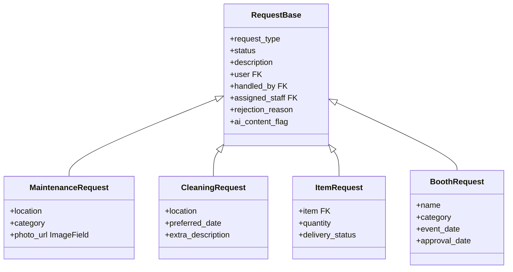

# Database & Models

The database is **PostgreSQL 16**, accessed via Django ORM. All models use integer primary keys (`BigAutoField`), Persian `verbose_name` labels, and standard timestamp patterns (`created_at` / `updated_at` where applicable).

---

## Entity Relationship Overview

```mermaid
erDiagram
    Role ||--o{ User : has
    Block ||--o{ User : assigned_to
    Block ||--o{ Room : contains
    Room ||--o{ RoomAssignment : has
    User ||--o{ RoomAssignment : receives

    User ||--o{ RequestBase : submits
    User ||--o{ RequestBase : handles
    RequestBase ||--o| MaintenanceRequest : extends
    RequestBase ||--o| CleaningRequest : extends
    RequestBase ||--o| ItemRequest : extends
    RequestBase ||--o| BoothRequest : extends
    RequestBase ||--o{ RequestStatusHistory : tracks
    RequestBase ||--o{ Notification : triggers

    InventoryItem ||--o{ ItemRequest : requested

    User ||--o{ IdeaComplaint : creates
    IdeaComplaint ||--o{ Vote : receives
    User ||--o{ Vote : casts

    User ||--o{ Class : creates
    User ||--o{ Class : teaches
    Class ||--o{ ClassRegistration : has
    User ||--o{ ClassRegistration : enrolls
    Class ||--o{ Rating : has
    User ||--o{ Rating : gives

    User ||--o{ Announcement : publishes
    User ||--o{ Notification : receives
```

---

## Users & Authentication

### `Role` (`users.Role`)

| Field | Type | Notes |
|-------|------|-------|
| `name` | CharField | `student`, `supervisor`, `admin` |
| `description` | TextField | Optional |

### `User` (`users.User`)

Extends `AbstractUser` with custom login identifier.

| Field | Type | Notes |
|-------|------|-------|
| `personnel_code` | CharField(20), unique | **USERNAME_FIELD** — student number or staff code |
| `national_code` | CharField(10), unique | Initial password in seed data |
| `first_name`, `last_name` | Inherited | Required |
| `email` | EmailField | Optional |
| `role` | FK → Role | Determines permissions |
| `block` | FK → Block | Optional dorm block association |
| `username` | Removed (`None`) | Login uses `personnel_code` only |

**Login:** All roles use the same form; role is resolved after authentication via the `role` FK.

---

## Dormitory Structure

### `Block` (`dorms.Block`)

| Field | Type | Notes |
|-------|------|-------|
| `name` | CharField | e.g. "بلوک الف" |
| `total_floors` | PositiveIntegerField | |
| `room_numbers` | JSONField | Structured room metadata |

### `Room` (`dorms.Room`)

| Field | Type | Notes |
|-------|------|-------|
| `block` | FK → Block | |
| `room_number` | CharField | Unique per block |
| `floor` | PositiveIntegerField | |
| `capacity` | PositiveIntegerField | |

**Constraint:** `unique_together (block, room_number)`

### `RoomAssignment` (`dorms.RoomAssignment`)

Links a student to a room for a date range.

| Field | Type | Notes |
|-------|------|-------|
| `user` | FK → User | |
| `room` | FK → Room | |
| `assigned_from` | DateField | |
| `assigned_to` | DateField | Nullable — open-ended if null |
| `is_current` | BooleanField | Default `True` |

**Critical constraint:** Only one active assignment per user:

```python
UniqueConstraint(
    fields=['user'],
    condition=Q(is_current=True),
    name='unique_active_room_assignment_per_user',
)
```

The profile API resolves `block_name` and `room_number` from the current assignment (with fallback to `user.block`).

---

## Polymorphic Request System

The request domain uses **Django multi-table inheritance (MTI)**. `RequestBase` is a concrete parent table; each child model has a one-to-one PK/FK to `RequestBase`.



### `RequestBase` (`requests_app.RequestBase`)

| Field | Type | Choices / Notes |
|-------|------|-----------------|
| `request_type` | CharField | `maintenance`, `cleaning`, `item`, `booth` |
| `status` | CharField | `pending`, `in_progress`, `approved`, `rejected`, `completed` |
| `description` | TextField | |
| `user` | FK → User | Requester (`related_name='requests'`) |
| `handled_by` | FK → User | Supervisor who processed |
| `assigned_staff` | FK → User | Staff assigned to fulfill |
| `rejection_reason` | TextField | Required when rejecting |
| `ai_content_flag` | BooleanField | Nullable — future AI moderation |
| `created_at`, `updated_at` | DateTimeField | Auto timestamps |

### Child Models

#### `MaintenanceRequest`

| Field | Notes |
|-------|-------|
| `location` | CharField — block/area |
| `category` | `bathroom`, `bath`, `kitchen`, `room`, `facilities` |
| `photo_url` | ImageField → `media/maintenance/` |

#### `CleaningRequest`

| Field | Notes |
|-------|-------|
| `location` | CharField |
| `preferred_date` | DateField |
| `extra_description` | TextField, optional |

#### `ItemRequest`

| Field | Notes |
|-------|-------|
| `item` | FK → `InventoryItem` |
| `quantity` | PositiveIntegerField (1–3 enforced in service) |
| `delivery_status` | CharField, optional |

#### `BoothRequest`

| Field | Notes |
|-------|-------|
| `name` | Booth/business name |
| `category` | Product/service type |
| `event_date` | DateField |
| `approval_date` | DateField, nullable |

### `InventoryItem` (`requests_app.InventoryItem`)

| Field | Type |
|-------|------|
| `item_name` | CharField |
| `category` | CharField |
| `quantity` | PositiveIntegerField (stock) |
| `description` | TextField |

### `RequestStatusHistory` (`requests_app.RequestStatusHistory`)

Audit trail for supervisor actions.

| Field | Notes |
|-------|-------|
| `request` | FK → RequestBase |
| `previous_status` | Nullable on first transition |
| `new_status` | |
| `acting_supervisor` | FK → User |
| `comment` | TextField |
| `rejection_reason` | TextField |
| `created_at` | Auto |

Created by `RequestService.change_status()` on every valid transition.

### Request Business Rules (Service Layer)

| Rule | Limit |
|------|-------|
| Combined active requests per student | 10 |
| Active cleaning requests | 3 |
| Active item requests | 3 |
| Item quantity per request | 1–3 |
| Active booth requests per event date | 1 |
| Rejection | `rejection_reason` required |

**Active statuses:** `pending`, `in_progress`, `approved`

### Signals

`requests_app/signals.py` creates a `Notification` for the requester when `RequestBase.status` changes (via `pre_save` + `post_save`).

---

## Ideas & Feedback

### `IdeaComplaint` (`ideas.IdeaComplaint`)

Unified model for suggestions, ideas, and complaints.

| Field | Notes |
|-------|-------|
| `type` | `suggestion`, `idea`, `complaint` |
| `category` | cleaning, facilities, welfare, security, education, maintenance, other |
| `title`, `description` | |
| `status` | `pending`, `reviewed`, `answered`, `rejected` |
| `supervisor_response` | TextField |
| `responded_by`, `responded_at` | Supervisor metadata |
| `responded_within_sla` | Boolean — 72-hour SLA |
| `upvotes` | IntegerField |

Complaints and suggestions are exposed via separate REST namespaces but share this model (filtered by `type`).

### `Vote` (`ideas.Vote`)

| Field | Notes |
|-------|-------|
| `user` | FK → User |
| `idea` | FK → IdeaComplaint |
| `vote_type` | `up`, `down` |

**Constraint:** `unique_together (user, idea)`

---

## Classes

### `Class` (`classes.Class`)

| Field | Notes |
|-------|-------|
| `title`, `description`, `location` | |
| `capacity` | Total seats |
| `start_datetime`, `end_datetime` | |
| `status` | `active`, `completed`, `cancelled` |
| `created_by` | FK → User (supervisor) |
| `teacher` | FK → User |
| `category` | `educational`, `sports`, `cultural`, `art` |

**Computed properties (not DB columns):**

- `registered_count` — non-cancelled registrations
- `remaining_capacity` — `capacity - registered_count`
- `is_full` — `remaining_capacity <= 0`

List views should use `.annotate(active_count=Count(...))` for performance.

### `ClassRegistration`

| Field | Notes |
|-------|-------|
| `user`, `class_instance` | FKs |
| `is_cancelled` | Boolean — frees a seat when True |
| `cancelled_at` | Set automatically on cancel |

**Constraint:** `unique_together (user, class_instance)` — one row per student/class (cancelled rows remain).

Registration uses `select_for_update()` + `transaction.atomic()` to prevent overbooking.

### `Rating`

| Field | Notes |
|-------|-------|
| `user`, `class_instance` | Direct FK to Class (no GenericForeignKey) |
| `score` | 1–5 |
| `comment` | TextField |

**Constraint:** `unique_together (user, class_instance)`

---

## Announcements & Notifications

### `Announcement` (`announcements.Announcement`)

| Field | Notes |
|-------|-------|
| `title`, `content` | |
| `created_by` | FK → User |
| `is_active` | Soft visibility flag |
| `created_at` | |

### `Notification` (`core.Notification`)

| Field | Notes |
|-------|-------|
| `user` | FK → User |
| `message` | TextField |
| `related_request` | FK → RequestBase, nullable |
| `related_idea_complaint` | FK → IdeaComplaint, nullable |
| `is_read` | BooleanField |
| `created_at` | |

---

## Database Configuration

From `config/settings.py`:

```python
DATABASE_URL = os.environ.get('DATABASE_URL')
# Falls back to POSTGRES_* env vars with host 'db' in Docker
```

Media and static paths:

| Setting | Path |
|---------|------|
| `MEDIA_ROOT` | `backend/media/` (Docker volume `media_files`) |
| `MEDIA_URL` | `/media/` |
| `STATIC_ROOT` | `backend/staticfiles/` (Docker volume `static_files`) |
| `STATIC_URL` | `/static/` |

---

## Seeding

Run after migrations:

```bash
python manage.py seed_data
```

The command:

1. Creates `Role` records (student, supervisor, admin)
2. Creates blocks, rooms, assignments, inventory, users (password = `national_code`)
3. Populates at least 5 realistic Persian records per model
4. Ensures no dangling foreign keys

---

## Indexes

Frequently queried fields are indexed across models — notably `user`, `status`, `created_at` on requests; `is_current` on room assignments; `is_active` on announcements; and composite indexes on feedback SLA fields.
