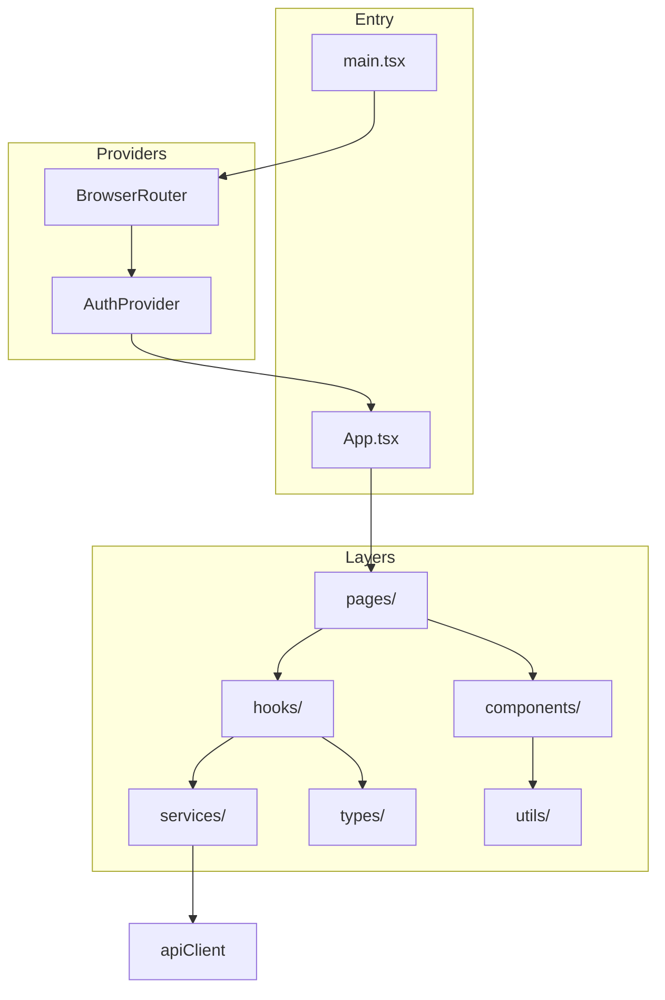
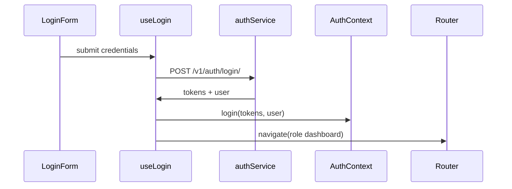
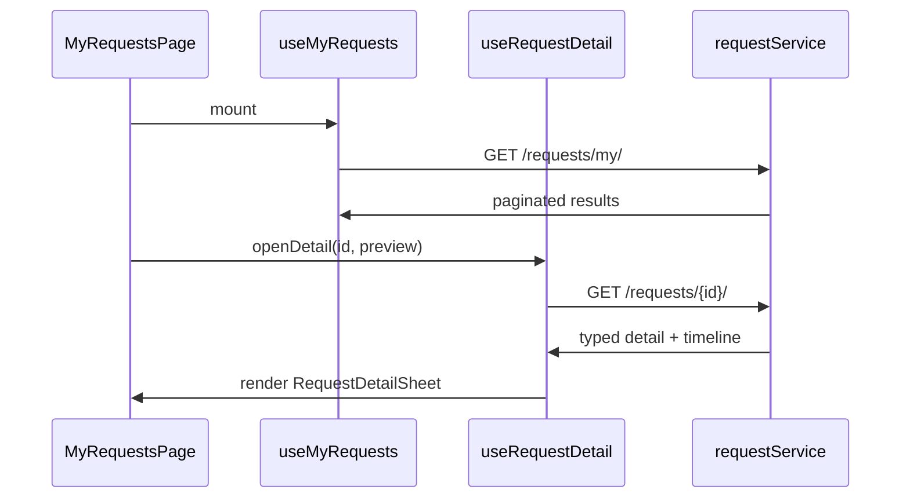

# Frontend Architecture

The frontend is a **React 19 + TypeScript** single-page application built with **Vite 8**, styled with **Tailwind CSS 4**, and designed for **RTL Persian** users. It follows a feature-based folder structure with custom hooks for data fetching and react-hook-form for forms.

---

## High-Level Structure



---

## Folder Structure

```
frontend/src/
├── main.tsx                 # React root, providers
├── App.tsx                  # Route definitions
├── index.css                # Design tokens, Tailwind, RTL globals
│
├── pages/
│   ├── auth/
│   │   └── LoginPage.tsx
│   └── student/
│       ├── DashboardPage.tsx
│       ├── MaintenanceReportPage.tsx
│       ├── CleaningRequestPage.tsx
│       ├── RoomSuppliesRequestPage.tsx
│       ├── BoothRequestPage.tsx
│       ├── MyRequestsPage.tsx
│       └── ProfilePage.tsx
│
├── components/
│   ├── auth/                # LoginForm, AuthHero
│   ├── dashboard/           # Banner, FeatureCard, SectionHeader
│   ├── layout/              # BottomNav
│   ├── maintenance/         # Form, CategorySelector, PhotoUploader
│   ├── cleaning/            # Form, BlockFloorSelector
│   ├── item/                # ItemRequestForm, ItemSelector
│   ├── booth/               # BoothRequestForm
│   ├── requests/            # RequestCard, FilterTabs, DetailSheet, Timeline
│   ├── profile/             # Header, info cards, logout dialog
│   ├── shared/              # BlockDropdown, ReadOnlyLocationFields
│   └── ui/                  # BottomSheet, Toast, Skeleton, StatusBadge
│
├── hooks/                   # Feature-specific state + side effects
├── services/                # Axios API wrappers
├── context/                 # AuthContext + authContext.ts
├── types/                   # TypeScript interfaces per domain
├── utils/                   # requestHelpers, formatRelativeDate
└── data/                    # Static dashboard config (dashboardItems.ts)
```

---

## Routing

Defined in `App.tsx` using React Router 7:

| Path | Component | Status |
|------|-----------|--------|
| `/login` | LoginPage | ✅ Complete |
| `/dashboard` | DashboardPage | ✅ Complete |
| `/maintenance-request` | MaintenanceReportPage | ✅ Complete |
| `/cleaning-request` | CleaningRequestPage | ✅ Complete |
| `/item-request` | RoomSuppliesRequestPage | ✅ Complete |
| `/booth-request` | BoothRequestPage | ✅ Complete |
| `/my-requests` | MyRequestsPage | ✅ Complete |
| `/profile` | ProfilePage | ✅ Complete |
| `/announcements` | Placeholder | ⏳ Not implemented |
| `/class-registration` | Placeholder | ⏳ Not implemented |
| `/ideas` | Placeholder | ⏳ Not implemented |
| `/complaints` | Placeholder | ⏳ Not implemented |
| `/supervisor/dashboard` | Placeholder | ⏳ Not implemented |
| `/admin/dashboard` | Placeholder | ⏳ Not implemented |
| `/` | Redirect → `/login` | |
| `*` | Redirect → `/login` | |

**Note:** There are no route guards. Authentication state exists in context but routes are not wrapped in a protected route component.

Post-login redirect uses role from `getDashboardPathForRole()` in `types/auth.ts`.

---

## Authentication Pattern

### AuthProvider (`context/AuthContext.tsx`)

- Persists `access`, `refresh`, and serialized user in `localStorage`
- Exposes `{ user, tokens, isAuthenticated, login, logout }`
- Consumed via `useAuth()` hook

### Login flow



### API client (`services/apiClient.ts`)

```typescript
const apiClient = axios.create({
  baseURL: import.meta.env.VITE_API_BASE_URL ?? 'http://localhost:8000/api',
})
```

**Current limitation:** No global request interceptor attaches the JWT. Each service method passes `Authorization: Bearer ${accessToken}` explicitly. There is no automatic token refresh on 401.

---

## Design Patterns

### 1. Custom Hooks per Feature

Business logic lives in hooks; pages stay thin.

| Hook | Purpose |
|------|---------|
| `useLogin` | Login form submission, error state, navigation |
| `useAuth` | Read auth context |
| `useProfile` | Fetch/update profile |
| `useRoomAssignment` | Resolve student block/room from profile |
| `useMaintenanceReport` | Maintenance form state + submit |
| `useCleaningRequest` | Cleaning form + submit |
| `useItemRequest` | Item request form + submit |
| `useBoothRequest` | Booth form + submit |
| `useMyRequests` | Paginated request list + filters |
| `useRequestDetail` | Detail fetch + BottomSheet open/close |

### 2. Service Layer

One service file per API domain:

| Service | Endpoints used |
|---------|----------------|
| `authService.ts` | `/v1/auth/login/`, `/v1/auth/profile/` |
| `requestService.ts` | `/v1/requests/my/`, `/v1/requests/{id}/` |
| `maintenanceService.ts` | `/v1/requests/maintenance/` |
| `cleaningService.ts` | `/v1/requests/cleaning/` |
| `itemService.ts` | `/v1/requests/items/`, inventory |
| `boothService.ts` | `/v1/requests/booths/` |
| `blockService.ts` | `/v1/blocks/` |

All services parse the backend envelope (`success`, `message`, `data`) and throw user-friendly Persian errors.

### 3. Form Handling

**Stack:** react-hook-form + Zod (via `@hookform/resolvers`) + controlled sub-components

Example pattern from `MaintenanceReportForm`:

```tsx
const { form, submitReport } = useMaintenanceReport()
const { control, handleSubmit, watch, formState: { errors } } = form

<Controller
  control={control}
  name="category"
  render={({ field }) => (
    <CategorySelector
      value={field.value}
      onChange={field.onChange}
      error={errors.category?.message}
    />
  )}
/>
```

**Validation:** Zod schemas live alongside types (e.g. `types/maintenance.ts`). Hooks initialize `useForm` with `zodResolver`.

**File uploads:** Maintenance photos use `FormData` in the service layer (`PhotoUploader` sets a `File` in form state).

**Location fields:** Block/room often pre-filled from profile via `useRoomAssignment` + `ReadOnlyLocationFields` when category is "room".

### 4. Page Composition

Typical student page layout:

```
┌─────────────────────────────┐
│  Header (back button)       │
├─────────────────────────────┤
│  Page title                 │
│  Form or content            │
├─────────────────────────────┤
│  BottomNav (fixed)          │
└─────────────────────────────┘
```

`page-gradient` and `glass-card` utility classes from `index.css` implement the design system.

---

## Bottom Sheet Pattern

`components/ui/BottomSheet.tsx` is a reusable modal drawer used for request details on **My Requests**.

**Features:**

- Fixed overlay with scrim + blur
- Slide-up panel (mobile) / centered dialog (sm+)
- Body scroll lock while open
- Escape key + backdrop click to close
- RTL header with close button and title/subtitle
- Footer "بستن" button

**Usage in MyRequestsPage:**

```tsx
const { detail, preview, selectedId, openDetail, closeDetail } = useRequestDetail()

<BottomSheet
  isOpen={selectedId !== null}
  onClose={closeDetail}
  title={sheetTitle}
  subtitle={sheetSubtitle}
>
  <RequestDetailSheet
    request={detail}
    preview={preview}
    isLoading={isDetailLoading}
    error={detailError}
    onRetry={retryDetail}
  />
</BottomSheet>
```

**Optimistic preview:** When a card is tapped, list item data shows immediately (`preview`) while `fetchRequestDetail` loads full typed detail (`detail`).

---

## Request List & Detail Flow



**Supporting components:**

| Component | Role |
|-----------|------|
| `RequestFilterTabs` | Filter by request type |
| `RequestCard` | List item with status badge |
| `RequestCardSkeleton` | Loading placeholder |
| `RequestEmptyState` | Empty list message |
| `RequestTimeline` | Status history visualization |
| `StatusBadge` | Colored status chip |
| `Toast` | Error with retry action |

**Helpers:** `utils/requestHelpers.ts` — labels, timeline steps, detail row builders, effective status logic.

---

## Design System

Documented in `docs/design-en.md`. Key aspects implemented in `index.css`:

| Aspect | Implementation |
|--------|----------------|
| Direction | `direction: rtl` |
| Font | Vazirmatn (Google Fonts) |
| Colors | Primary `#C6A5DF`, ink `#2E1145`, status badge palettes |
| Spacing | 8px base unit |
| Radius | 12px cards, full-round badges |
| Surfaces | `glass-card`, `page-gradient`, `surface-dark` for nav |

**BottomNav** (`components/layout/BottomNav.tsx`): Fixed bottom navigation on student pages with active tab highlighting.

**Dashboard** uses `FeatureCard` components driven by static config in `data/dashboardItems.ts` (image assets from `@media` alias → repo `media/` folder).

---

## State Management

| Concern | Approach |
|---------|----------|
| Auth | React Context + localStorage |
| Server data | Custom hooks with `useState` / `useEffect` |
| Forms | react-hook-form local state |
| Global UI | Component-local state (toasts, sheet open) |

**Redux Toolkit** is in `package.json` but **not used** — no `src/store/` directory exists. Future global state can migrate here if needed.

---

## TypeScript Types

Domain types mirror backend serializers:

| File | Contents |
|------|----------|
| `types/auth.ts` | User, tokens, API envelope, role helpers |
| `types/request.ts` | Request list/detail, pagination, RequestType |
| `types/maintenance.ts` | Categories, form schema |
| `types/cleaning.ts` | Cleaning form fields |
| `types/item.ts` | Inventory item, quantity |
| `types/booth.ts` | Booth form fields |
| `types/dashboard.ts` | Feature card config |

---

## Build & Dev Configuration

**Vite** (`vite.config.ts`):

- Plugins: `@vitejs/plugin-react`, `@tailwindcss/vite`
- Alias: `@media` → repo root `media/`
- Dev proxy: `/api` → `http://localhost:8000`

**Environment variables:**

| Variable | Purpose |
|----------|---------|
| `VITE_API_BASE_URL` | Axios base URL (default `http://localhost:8000/api`) |
| `VITE_GRAPHQL_URL` | Reserved for future GraphQL client |

**Docker production:** Nginx serves `dist/` and proxies API to backend (see [Docker Setup](./docker-setup.md)).

---

## Testing

Jest and React Testing Library are in devDependencies. No test files are present in `src/` yet. README documents:

```bash
docker compose exec frontend npm test
```

---

## Frontend Completion Matrix

| Feature | UI | API Integration |
|---------|----|--------------------|
| Login | ✅ | ✅ |
| Dashboard | ✅ | — (static links) |
| Maintenance report | ✅ | ✅ |
| Cleaning request | ✅ | ✅ |
| Item request | ✅ | ✅ |
| Booth request | ✅ | ✅ |
| My requests list | ✅ | ✅ |
| Request detail sheet | ✅ | ✅ (`GET /requests/{id}/`) |
| Profile | ✅ | ✅ |
| Announcements | Placeholder | Backend ready |
| Classes | Placeholder | Backend ready |
| Ideas / complaints | Placeholder | Backend ready |
| Supervisor UI | Placeholder | Backend + GraphQL ready |
| Notifications UI | — | Backend ready |
| Route protection | — | Not implemented |
| JWT auto-refresh | — | Not implemented |

---

## Recommended Next Steps

1. Add `ProtectedRoute` wrapper checking `isAuthenticated` and role
2. Register axios interceptors for JWT attach + refresh on 401
3. Implement placeholder pages (announcements, classes, ideas)
4. Build supervisor dashboard consuming REST or GraphQL feed
5. Either wire Redux for shared server cache or adopt TanStack Query
6. Add frontend tests for critical flows (login, submit request, detail sheet)
