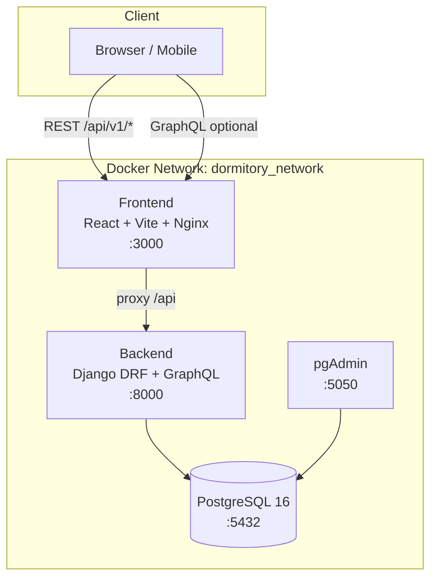

# Project Overview

The **Dormitory Management System** is a full-stack platform for managing university dormitory operations: maintenance reports, cleaning requests, room supplies, booth registrations, cultural classes, ideas/complaints, and announcements. The UI is **RTL (Persian/Farsi)** and targets mobile-first student workflows with supervisor/admin tooling on the backend.

---

## Architecture

The system follows a **Service-Oriented Architecture (SOA)** with a clear separation between domain apps on the backend, a React SPA on the frontend, and PostgreSQL as the persistence layer. All services run in Docker on a shared bridge network.



### Backend

- **Framework:** Django 6.0.6 with Django REST Framework 3.17
- **Pattern:** Domain-driven apps with **selectors** (read/query) and **services** (write/business logic)
- **APIs:** REST (primary) + GraphQL (supervisor request feed and mutations)
- **Docs:** OpenAPI via **drf-spectacular** at `/api/docs/`
- **Auth:** JWT (SimpleJWT) with token rotation and blacklist

### Frontend

- **Framework:** React 19 + TypeScript 6
- **Build:** Vite 8
- **Styling:** Tailwind CSS 4 (RTL, Vazirmatn font)
- **State:** React Context for auth; custom hooks per feature (Redux Toolkit is listed in dependencies but not wired up yet)
- **Forms:** react-hook-form + Zod validation

### Database

- **Engine:** PostgreSQL 16 (Alpine image in Docker)
- **ORM:** Django models with multi-table inheritance for polymorphic requests
- **Seeding:** `python manage.py seed_data` populates realistic Persian sample data

---

## Technology Versions

| Layer | Technology | Version |
|-------|------------|---------|
| Language (backend) | Python | 3.12 |
| Web framework | Django | 6.0.6 |
| REST API | djangorestframework | 3.17.1 |
| JWT | djangorestframework-simplejwt | (unpinned in requirements) |
| GraphQL | graphene-django | 3.2.3 |
| OpenAPI | drf-spectacular | 0.29.0 |
| Database | PostgreSQL | 16-alpine |
| DB driver | psycopg2-binary | 2.9.12 |
| Images | Pillow | 11.2.1 |
| Language (frontend) | TypeScript | ~6.0.2 |
| UI library | React | 19.2.6 |
| Bundler | Vite | 8.0.12 |
| CSS | Tailwind CSS | 4.3.0 |
| HTTP client | Axios | 1.17.0 |
| Forms | react-hook-form | 7.79.0 |
| Validation | Zod | 4.4.3 |
| Node (Docker) | Node.js | 20-alpine |

---

## Repository Structure

```
dormitory-management/
├── backend/                 # Django project (config + domain apps)
│   ├── config/              # settings, urls, wsgi/asgi
│   ├── core/                # Notification model, shared API helpers
│   ├── users/               # User, Role, JWT auth
│   ├── dorms/               # Block, Room, RoomAssignment
│   ├── requests_app/        # RequestBase + child requests, inventory
│   ├── classes/             # Class, registration, ratings
│   ├── ideas/               # IdeaComplaint, Vote, feedback SLA
│   ├── announcements/       # Announcement CRUD
│   └── dormitory/           # GraphQL schema layer
├── frontend/                # React SPA
│   └── src/
│       ├── components/      # UI, forms, layout
│       ├── pages/           # Route-level screens
│       ├── hooks/           # Feature hooks
│       ├── services/        # API clients
│       ├── context/         # AuthProvider
│       ├── types/           # TypeScript interfaces
│       └── utils/           # Helpers
├── docker-compose.yml
├── env.example
└── docs/                    # Project documentation
```

---

## Backend Domain Apps

| App | Responsibility |
|-----|----------------|
| `core` | Shared `Notification` model, notification REST endpoints, API response envelope |
| `users` | Custom `User` (login via `personnel_code`), `Role`, JWT login/logout/profile |
| `dorms` | `Block`, `Room`, `RoomAssignment` — dorm structure and student room lookup |
| `requests_app` | Polymorphic request system (maintenance, cleaning, item, booth), inventory, complaints/suggestions |
| `classes` | Cultural/educational classes, registration, ratings |
| `ideas` | Ideas, suggestions, complaints with voting and supervisor SLA workflow |
| `announcements` | Dorm announcements |
| `dormitory` | GraphQL schema (queries/mutations) over request domain |

---

## Current Status & Known Issues

### Completed (Backend)

- Full Django model layer with Persian verbose names and indexes
- JWT authentication with refresh rotation and blacklist
- REST API for auth, blocks, all request types, classes, ideas, complaints, suggestions, announcements, notifications
- Unified student request list (`GET /api/v1/requests/my/`) and polymorphic detail (`GET /api/v1/requests/{id}/`)
- Supervisor status changes, timeline, and GraphQL supervisor feed
- Request status history (`RequestStatusHistory`) and automatic notifications on status change
- Business rules: active request limits, item quantity caps, booth per-event limits, rejection reason required
- Extensive test suite (26+ test modules across apps)

### Completed (Frontend — Student)

- Login flow with role-based dashboard redirect
- Student dashboard with feature cards
- Maintenance, cleaning, item, and booth request forms (react-hook-form + Zod)
- My Requests page with filter tabs, cards, **BottomSheet** detail view, and timeline
- Profile page with logout
- Bottom navigation layout
- Design system tokens (RTL, glass cards, status badges)

### In Progress / Placeholder

| Area | Status |
|------|--------|
| Announcements page | Route exists; shows placeholder |
| Class registration | Route exists; shows placeholder |
| Ideas & complaints pages | Route exists; shows placeholder |
| Supervisor dashboard | Route exists; shows placeholder |
| Admin dashboard | Route exists; shows placeholder |
| Route guards | No protected routes — unauthenticated users can navigate to student pages |
| Global axios JWT interceptor | Tokens passed manually per service call; no auto-refresh |
| Redux store | Dependency installed; `src/store/` not created — auth uses Context |

### Known Gaps & Bugs

1. **README vs reality:** Root README references Swagger at `/swagger/` and drf-yasg; actual docs are at `/api/docs/` via drf-spectacular.
2. **Docker frontend target:** `docker-compose.yml` builds the **production** Nginx stage (port 80 → 3000) but mounts `./frontend:/app`, which only applies to the development stage. For hot-reload dev, set `target: development` and map port `3000:3000`.
3. **Duplicate import** in `requests_app/views.py` (`RequestServiceError` imported twice) — cosmetic, no runtime impact.
4. **`authenticate()` call** in `AuthService` relies on Django's default backend with `USERNAME_FIELD = 'personnel_code'`; no custom backend is registered (works when credentials are validated via `check_password` first).
5. **GraphQL** is implemented for supervisor workflows but the frontend does not consume it yet (uses REST only).

---

## Quick Links

| Resource | URL (local) |
|----------|---------------|
| Frontend | http://localhost:3000 |
| API base | http://localhost:8000/api/v1/ |
| Swagger UI | http://localhost:8000/api/docs/ |
| OpenAPI schema | http://localhost:8000/api/schema/ |
| GraphQL (GraphiQL in DEBUG) | http://localhost:8000/graphql/ |
| Django Admin | http://localhost:8000/admin/ |
| pgAdmin | http://localhost:5050 |

See also: [Docker Setup](./docker-setup.md) · [Database Models](./database-models.md) · [API Endpoints](./api-endpoints.md) · [Frontend Architecture](./frontend-architecture.md)
